# Diagrama de Casos de Uso - Smart Scheduled API

```mermaid
graph TB
    classDef actor fill:#f9f,stroke:#333,stroke-width:2px
    classDef usecase fill:#ccf,stroke:#333,stroke-width:1px
    classDef boundary fill:none,stroke:#333,stroke-width:1px,stroke-dasharray: 5 5

    %% Atores
    User((Usuário)):::actor
    Admin((Administrador)):::actor
    Leader((Líder do Time)):::actor
    Editor((Editor)):::actor
    Viewer((Visualizador)):::actor
    System((Sistema)):::actor

    %% Sistema como fronteira
    subgraph SmartScheduledAPI["Smart Scheduled API"]
        %% Casos de uso de autenticação
        Login[Realizar Login]:::usecase
        Logout[Realizar Logout]:::usecase
        RefreshToken[Atualizar Token]:::usecase

        %% Casos de uso de gerenciamento de times
        ViewTeams[Visualizar Times]:::usecase
        CreateTeam[Criar Time]:::usecase
        UpdateTeam[Atualizar Time]:::usecase
        DeleteTeam[Excluir Time]:::usecase
        SelectTeam[Selecionar Time]:::usecase

        %% Casos de uso de gerenciamento de membros
        ManageTeamMembers[Gerenciar Membros do Time]:::usecase
        InviteUser[Convidar Usuário]:::usecase
        RemoveUser[Remover Usuário]:::usecase
        ChangeUserRule[Alterar Regra de Usuário]:::usecase

        %% Casos de uso de gerenciamento de usuários
        ManageUsers[Gerenciar Usuários]:::usecase
        AssignRole[Atribuir Papel]:::usecase
        AddUserToTeam[Adicionar Usuário ao Time]:::usecase
        SetUserRule[Definir Regra do Usuário]:::usecase

        %% Casos de uso de agendamentos
        ViewSchedules[Visualizar Agendamentos]:::usecase
        CreateSchedule[Criar Agendamento]:::usecase
        UpdateSchedule[Editar Agendamento]:::usecase
        DeleteSchedule[Excluir Agendamento]:::usecase

        %% Casos de uso de renderização
        GetRenderInfo[Obter Informações de Renderização]:::usecase
    end

    %% Relacionamentos do usuário comum
    User --> Login
    User --> Logout
    User --> RefreshToken
    User --> ViewTeams
    User --> SelectTeam
    User --> GetRenderInfo

    %% Relacionamentos do administrador
    Admin --> Login
    Admin --> Logout
    Admin --> RefreshToken
    Admin --> ViewTeams
    Admin --> CreateTeam
    Admin --> UpdateTeam
    Admin --> DeleteTeam
    Admin --> SelectTeam
    Admin --> ManageUsers
    Admin --> AssignRole
    Admin --> AddUserToTeam
    Admin --> SetUserRule
    Admin --> ViewSchedules
    Admin --> CreateSchedule
    Admin --> UpdateSchedule
    Admin --> DeleteSchedule
    Admin --> GetRenderInfo

    %% Relacionamentos do Líder do Time (Leader)
    Leader --> Login
    Leader --> Logout
    Leader --> RefreshToken
    Leader --> ViewTeams
    Leader --> SelectTeam
    Leader --> ManageTeamMembers
    Leader --> InviteUser
    Leader --> RemoveUser
    Leader --> ChangeUserRule
    Leader --> ViewSchedules
    Leader --> CreateSchedule
    Leader --> UpdateSchedule
    Leader --> DeleteSchedule
    Leader --> GetRenderInfo

    %% Relacionamentos do Editor
    Editor --> Login
    Editor --> Logout
    Editor --> RefreshToken
    Editor --> ViewTeams
    Editor --> SelectTeam
    Editor --> ViewSchedules
    Editor --> CreateSchedule
    Editor --> UpdateSchedule
    Editor --> DeleteSchedule
    Editor --> GetRenderInfo

    %% Relacionamentos do Visualizador (Viewer)
    Viewer --> Login
    Viewer --> Logout
    Viewer --> RefreshToken
    Viewer --> ViewTeams
    Viewer --> SelectTeam
    Viewer --> ViewSchedules
    Viewer --> GetRenderInfo

    %% Relacionamentos do sistema
    System --> GetRenderInfo

    %% Inclusões (include) e extensões (extend)
    ManageUsers -.-> |<<include>>| AssignRole
    ManageUsers -.-> |<<include>>| AddUserToTeam
    AddUserToTeam -.-> |<<include>>| SetUserRule
    ManageTeamMembers -.-> |<<include>>| InviteUser
    ManageTeamMembers -.-> |<<include>>| RemoveUser
    ManageTeamMembers -.-> |<<include>>| ChangeUserRule
    CreateSchedule -.-> |<<include>>| SelectTeam
    UpdateSchedule -.-> |<<include>>| SelectTeam
    ViewSchedules -.-> |<<include>>| SelectTeam
```

## Descrição dos Casos de Uso

### Casos de Uso de Autenticação

1. **Realizar Login**: Permite que usuários façam login no sistema.
2. **Realizar Logout**: Permite que usuários façam logout do sistema.
3. **Atualizar Token**: Atualiza o token JWT de autenticação quando ele está próximo de expirar.

### Casos de Uso de Gerenciamento de Times

1. **Visualizar Times**: Permite aos usuários visualizar os times disponíveis.
2. **Criar Time**: Permite aos administradores criar novos times.
3. **Atualizar Time**: Permite aos administradores atualizar informações de times existentes.
4. **Excluir Time**: Permite aos administradores excluir times.
5. **Selecionar Time**: Permite aos usuários selecionar um time para trabalhar.

### Casos de Uso de Gerenciamento de Membros do Time

1. **Gerenciar Membros do Time**: Permite ao líder do time gerenciar os membros.
2. **Convidar Usuário**: Permite ao líder convidar novos usuários para o time.
3. **Remover Usuário**: Permite ao líder remover usuários do time.
4. **Alterar Regra de Usuário**: Permite ao líder alterar a regra de um usuário no time.

### Casos de Uso de Gerenciamento de Usuários

1. **Gerenciar Usuários**: Permite aos administradores gerenciar usuários do sistema.
2. **Atribuir Papel**: Permite aos administradores atribuir papéis (roles) aos usuários.
3. **Adicionar Usuário ao Time**: Permite aos administradores adicionar usuários a times.
4. **Definir Regra do Usuário**: Permite aos administradores definir regras (rules) para usuários em times específicos.

### Casos de Uso de Agendamentos

1. **Visualizar Agendamentos**: Permite aos usuários visualizar agendamentos do time selecionado.
2. **Criar Agendamento**: Permite aos usuários criar novos agendamentos (dependendo da regra).
3. **Editar Agendamento**: Permite aos usuários editar agendamentos existentes (dependendo da regra).
4. **Excluir Agendamento**: Permite aos usuários excluir agendamentos (dependendo da regra).

### Casos de Uso de Renderização

1. **Obter Informações de Renderização**: Permite ao sistema determinar o que deve ser renderizado no front-end com base no papel, regra e time do usuário.

## Atores

1. **Usuário**: Representa um usuário comum do sistema com permissões básicas.
2. **Administrador**: Representa um usuário com permissões elevadas para gerenciar o sistema.
3. **Líder do Time (Leader)**: Representa um usuário com regra de Leader em um time específico, com capacidade de gerenciar membros e todo o conteúdo do time.
4. **Editor**: Representa um usuário com regra de Editor em um time específico, com capacidade de criar, editar e excluir agendamentos.
5. **Visualizador (Viewer)**: Representa um usuário com regra de Viewer em um time específico, com capacidade apenas de visualizar agendamentos.
6. **Sistema**: Representa o próprio sistema que executa operações automáticas.

## Relacionamentos

- **Inclusão (<<include>>)**: Indica que um caso de uso inclui a funcionalidade de outro caso de uso.
- **Extensão (<<extend>>)**: Indica que um caso de uso pode estender a funcionalidade de outro caso de uso.

## Regras (Rules) e suas Permissões

### Leader

- Gerenciar membros do time
- Convidar novos usuários
- Remover usuários
- Alterar regras de usuários
- Criar, editar e excluir agendamentos
- Visualizar todos os agendamentos do time

### Editor

- Criar agendamentos
- Editar agendamentos
- Excluir agendamentos
- Visualizar todos os agendamentos do time

### Viewer

- Visualizar agendamentos do time
- Sem permissões para criar, editar ou excluir agendamentos
