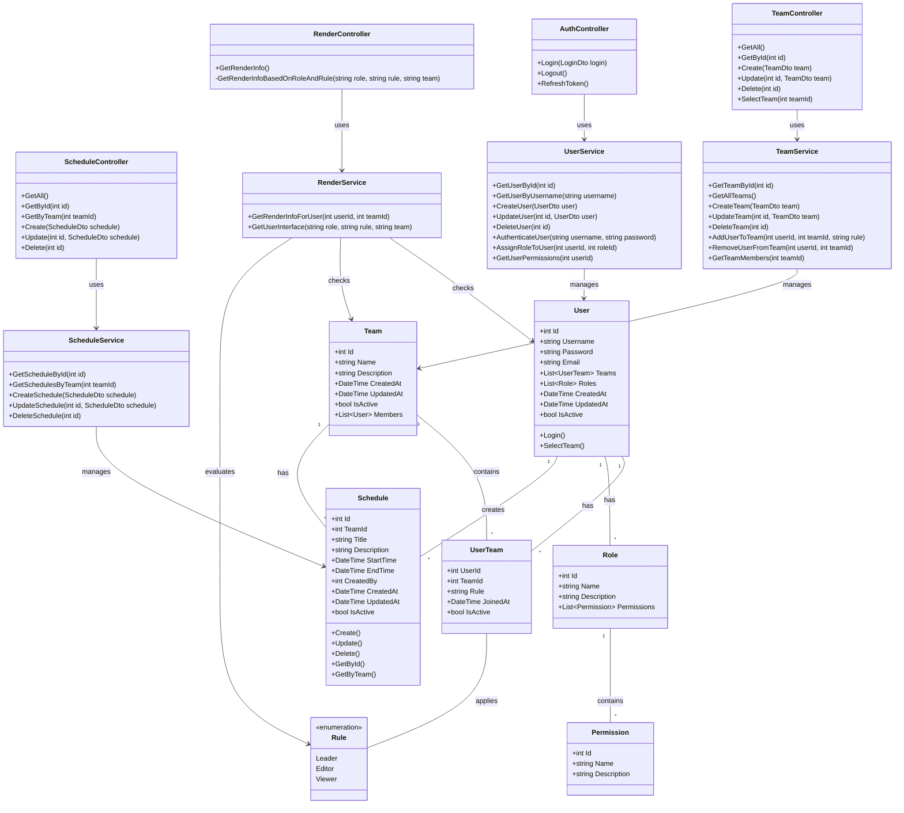

# Diagrama de Classes - Smart Scheduled API

## Descrição das Classes Principais

### Entidades

1. **User**: Representa um usuário do sistema.
2. **Role**: Representa um papel/função no sistema (ex: Admin, User).
3. **Permission**: Representa uma permissão específica.
4. **Team**: Representa uma equipe/time.
5. **UserTeam**: Associação entre User e Team, com a regra (rule) específica para o usuário naquele time.
6. **Rule**: Enumeração que define os tipos de regras disponíveis para usuários em times.
   - **Leader**: Papel de liderança no time, com permissões completas de gerenciamento.
   - **Editor**: Papel de editor, com permissões para criar e modificar agendamentos.
   - **Viewer**: Papel de visualizador, com permissões somente para leitura.
7. **Schedule**: Representa um agendamento.

### Controladores

1. **RenderController**: Gerencia a renderização baseada em papéis e regras.
2. **AuthController**: Gerencia autenticação de usuários.
3. **TeamController**: Gerencia operações de equipes.
4. **ScheduleController**: Gerencia operações de agendamentos.

### Serviços

1. **UserService**: Encapsula a lógica de negócios relacionada a usuários.
2. **TeamService**: Encapsula a lógica de negócios relacionada a equipes.
3. **ScheduleService**: Encapsula a lógica de negócios relacionada a agendamentos.
4. **RenderService**: Encapsula a lógica de determinação da interface a ser renderizada.

### Relacionamentos

- Um usuário pode pertencer a vários times (UserTeam)
- Um time pode conter vários usuários (UserTeam)
- Um usuário pode ter vários papéis
- Um papel pode ter várias permissões
- Um time pode ter vários agendamentos
- Um usuário pode criar vários agendamentos
- Uma associação UserTeam aplica uma regra específica (Leader, Editor, Viewer)
